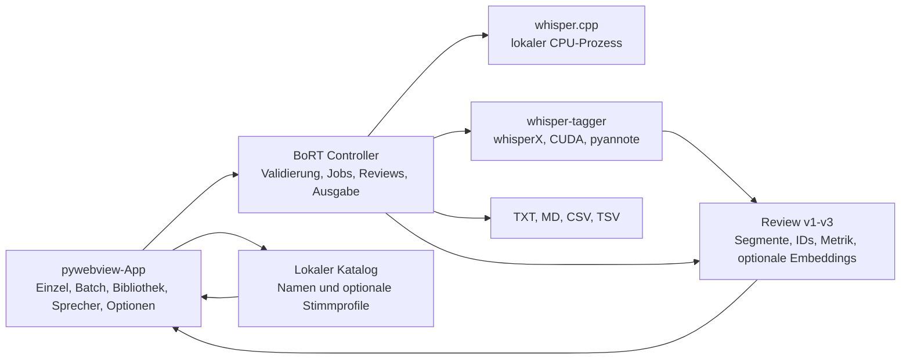

# Performance, globale Optionen und Sprecher-Workflow

Stand: 2026-08-20
Branch: `codex/performance-voice-catalog`

Dieses Dokument beschreibt die Architektur- und Produktänderungen dieses
Branches. Der Umsetzungsplan und die noch offenen Ausbaustufen stehen ergänzend
in [docs/plans/03-performance-voice-catalog.md](../plans/03-performance-voice-catalog.md).

## Systemüberblick



BoRT behält zwei getrennte Laufzeitpfade:

- **whisper.cpp** ist der schlanke CPU-Pfad. Audio wird mit ffmpeg nach 16 kHz
  Mono-WAV konvertiert und anschließend über das `whisper-cli`-Binary verarbeitet.
- **whisperX** ist der GPU-Pfad für Transkription, Alignment und
  Sprecher-Diarisierung. Die Python-/CUDA-Abhängigkeiten bleiben im externen
  Projekt `~/projects/whisper-tagger` und werden als Subprozess aufgerufen.

Es gibt keine Cloud-Übertragung durch BoRT. Audio, Ausgaben, Reviews und
Katalogdaten bleiben lokal.

## Modelle und Leistungsprofile

Für neue whisperX-Konfigurationen ist `large-v3-turbo` der Default. Das Modell
ist gegenüber `large-v3` die erste Wahl für schnelle lokale Transkriptionen;
`large-v3` bleibt die Qualitätsoption für schwieriges Audio.

| Profil | Beam | Batch | Einsatz |
|---|---:|---:|---|
| Schnell (`fast`) | 1 | 32 | Hoher Durchsatz, Entwürfe und lange klare Aufnahmen |
| Ausgewogen (`balanced`) | 3 | 24 | Standard für normale Transkriptionen |
| Maximale Qualität (`quality`) | 5 | 16 | Schwieriges Audio, geringerer Durchsatz |

Profil, Modell, Sprache, Diarisierungsmodus und bekannte Sprecherzahl werden in
`run_metadata` der Review festgehalten. whisperX kann zusätzlich Phasenlaufzeiten
als `runtime_metrics` liefern.

### Beobachtete lokale Messwerte

Die Messungen stammen von einem Ryzen 9 9900X3D mit RTX 5090/CUDA 12.8 und
Warm-Cache. Sie sind Richtwerte, kein universeller Benchmark:

- whisper.cpp `base`: 38,3 Sekunden Audio in 0,856 Sekunden, etwa 44,7-fache
  Echtzeit.
- whisperX `medium` mit Alignment, Diarisierung und Embeddings: 3,846 Sekunden
  interne Pipelinezeit.
- whisperX `large-v3-turbo`: 4,236 Sekunden interne Pipelinezeit; `large-v3`:
  5,261 Sekunden. Turbo war in diesem kurzen Lauf intern etwa 19,5 Prozent
  schneller.
- Turbo ohne Diarisierung und ohne unnötiges Alignment: 1,824 Sekunden interne
  Pipelinezeit.
- Der vollständige BoRT-Aufruf mit Turbo benötigte 8,664 Sekunden. Rund 4,4
  Sekunden entfielen damit auf Prozessstart sowie Python-/CUDA-Importe.

Für viele kurze Dateien ist daher ein persistenter GPU-Worker der größte noch
offene Performance-Hebel. Für Freigabeentscheidungen ist ein eigener Goldkorpus
mit WER/CER, Diarisierungsmetriken, RTF und Speicherverbrauch vorgesehen.

## whisper.cpp-Laufzeit

BoRT wählt standardmäßig die Hälfte der logischen CPUs, begrenzt auf zwölf
Threads. Beim Start wird der Ordner des gefundenen `whisper-cli` in den
prozesslokalen `LD_LIBRARY_PATH` aufgenommen. Dadurch funktioniert auch ein
vendorter Build mit Shared Libraries, ohne die Shell-Umgebung global zu ändern.

## Globale Transkriptionsoptionen

Der Reiter **Optionen** ist die zentrale Konfiguration für Einzel- und
Batchverarbeitung. Änderungen werden sofort unter
`~/.config/bort/settings.json` gespeichert.

Globale Werte sind:

- Backend, Sprache und Aufgabe,
- whisper.cpp-Modellpfad oder whisperX-Modell,
- Leistungsprofil sowie minimale/maximale Sprecherzahl,
- Diarisierung, automatische Marker und optionale Stimmprofile,
- Ausgabeformate und Ablage neben der Audio-Datei oder im Ausgabeordner,
- WAV-Aufbewahrung und ausführliches Protokoll.

Die Reiter **Transkribieren** und **Batch** zeigen eine kompakte Zusammenfassung
der aktiven Werte und verlinken direkt zu den Optionen.

## Sprecher-Review

### Empfohlener Ablauf

1. Eine `*.review.json`-Datei in **Sprecher** öffnen.
2. Einen Sprecher im kompakten Picker wählen oder seinen Namen direkt im
   Transkript anklicken.
3. Den Anzeigenamen eingeben, einen gespeicherten Namen wählen oder einen
   Stimmprofilvorschlag bestätigen.
4. Mit **Hörprobe** kontrollieren. Die Wiedergabe verändert die Scrollposition
   nicht. **Im Transkript zeigen** ist die getrennte Navigationsaktion.
5. Mit **Änderungen anwenden** die Review und alle konfigurierten Ausgabeformate
   atomar neu schreiben. Der schwebende Knopf bleibt beim Scrollen erreichbar.
6. Optional mit **Namen lokal merken** bestätigte Namen und – nur bei zuvor
   aktiviertem Opt-in – Stimmprofile in den Katalog übernehmen.

Ein Namensentwurf wird über die stabile Sprecher-ID verwaltet. Deshalb werden
alle sichtbaren Vorkommen im Transkript, der Picker und die Waveform gemeinsam
aktualisiert. Erst **Anwenden** schreibt Dateien auf die Platte.

Lange Transkripte besitzen keinen eigenen begrenzten Scrollcontainer mehr. Der
vollständige Inhalt wächst mit der Seite; der Segmentzähler zeigt, wie viele
Segmente geladen wurden.

## Namen- und Stimmprofilkatalog

Der Katalog liegt standardmäßig unter:

```text
~/.local/share/bort/voice_profiles.json
```

Ein Eintrag kann nur einen Namen oder zusätzlich ein Stimmprofil enthalten.
Stimmprofile bestehen aus einem normalisierten Embedding-Zentroiden,
Embedding-Modell, Dimension, Anzahl bestätigter Beispiele und Zeitstempeln.
Audioausschnitte werden nicht in den Katalog kopiert.

Sicherheitsregeln:

- Stimmprofile sind standardmäßig ausgeschaltet und werden ausdrücklich in den
  globalen Optionen aktiviert.
- Ein Treffer ist immer nur ein Vorschlag. BoRT benennt niemals automatisch um.
- Embeddings verschiedener Modelle oder Dimensionen werden nicht verglichen.
- Das Datenverzeichnis erhält Modus `0700`, die Datei Modus `0600`.
- Schreiben erfolgt atomar; ein beschädigter Katalog wird gemeldet und nicht
  automatisch ersetzt.
- Profile lassen sich einzeln aus der Sprecheransicht löschen.

## Review-Schemas

- **v1**: ursprüngliche Review ohne stabile Sprecher-ID pro Segment.
- **v2**: stabile `speaker_id` an Segmenten und Markern. Dadurch bleiben auch
  identische Anzeigenamen technisch getrennt.
- **v3**: ergänzt optionale `speaker_embeddings`, `embedding_model`,
  `runtime_metrics` und `run_metadata`.

BoRT liest alle drei Versionen. Neu geschriebene Reviews verwenden v2 oder v3,
abhängig von den enthaltenen Metadaten.

## Oberfläche und Design

Die aktive GUI ist eine lokale pywebview-Anwendung. Python stellt eine
thread-sichere Bridge zu Controllern und Dateidialogen bereit; HTML, CSS und
JavaScript rendern die Oberfläche.

Das Design kombiniert Glassmorphism und Neumorphism mit der bestehenden
Cyan-/Violett-Farbwelt. Die Sprecheransicht verwendet einen kompakten
Master-Detail-Picker, direkt editierbare Sprecherchips und eine schwebende
Speicheraktion. Light- und Dark-Theme bleiben verfügbar.

## Build und externe Voraussetzungen

Der Onefile-Build wird so erzeugt:

```bash
./scripts/build-test-executable.sh
./dist/test-build/BoRT-voice-catalog-linux-x86_64
```

Enthalten sind BoRT, GTK/WebKit-Ressourcen, das Web-Frontend, `whisper-cli` und
dessen Shared Libraries. Nicht enthalten sind:

- GGML-Modelldateien,
- das externe `~/projects/whisper-tagger`,
- dessen PyTorch-/CUDA-Umgebung und Hugging-Face-Token.

Der whisperX-Pfad benötigt im externen Projekt die Unterstützung für
`--beam-size`, `--batch-size`, `--return-embeddings` und Laufmetrik. Der zu
diesem Branch getestete Begleitstand ist Commit `0ec2af0` im
whisper-tagger-Checkout.

Die vollständige manuelle Testmatrix steht unter
[docs/testing/voice-catalog-test-build.md](../testing/voice-catalog-test-build.md).

## Bekannte Grenzen und nächste Schritte

- Der whisperX-Prozess und seine Modelle werden weiterhin pro Datei neu geladen.
- Ein Goldkorpusvergleich von `large-v3-turbo`, `large-v3` und alternativen
  Backends steht aus.
- pyannote Community-1 und segmentgenaues Splitten an Sprecherwechseln sind noch
  nicht freigegeben.
- Der Katalog besitzt Einzel-Löschen, aber noch keinen Export und keinen
  Gesamtreset in der UI.
- Stimmprofile unterstützen den lokalen Workflow; sie sind keine verlässliche
  Identitätsfeststellung und dürfen nicht als automatische biometrische
  Entscheidung verwendet werden.
